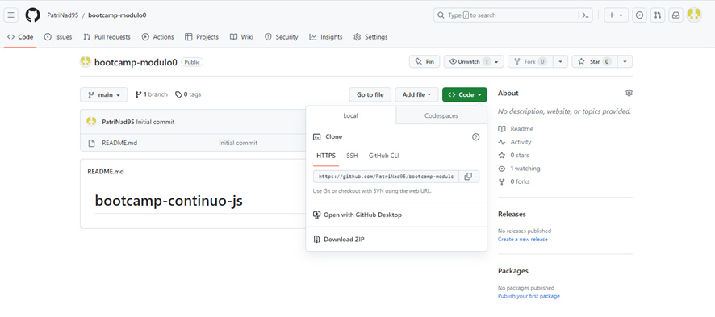
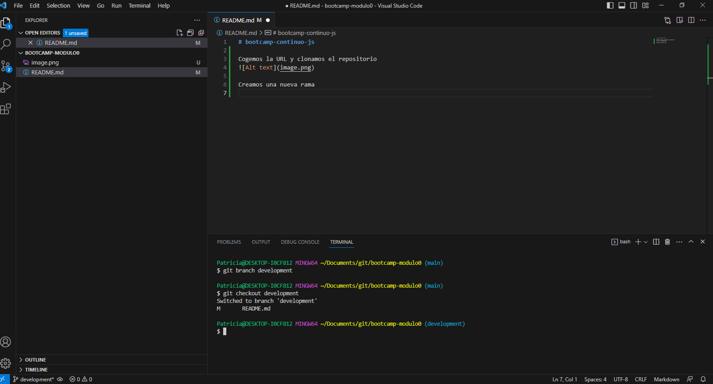
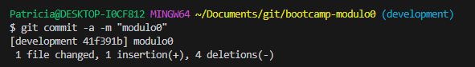
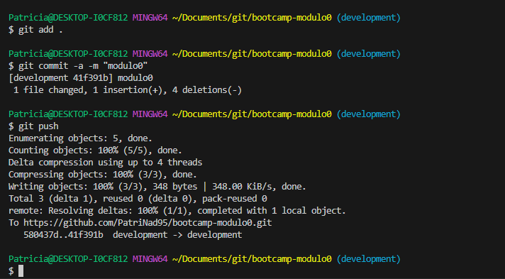
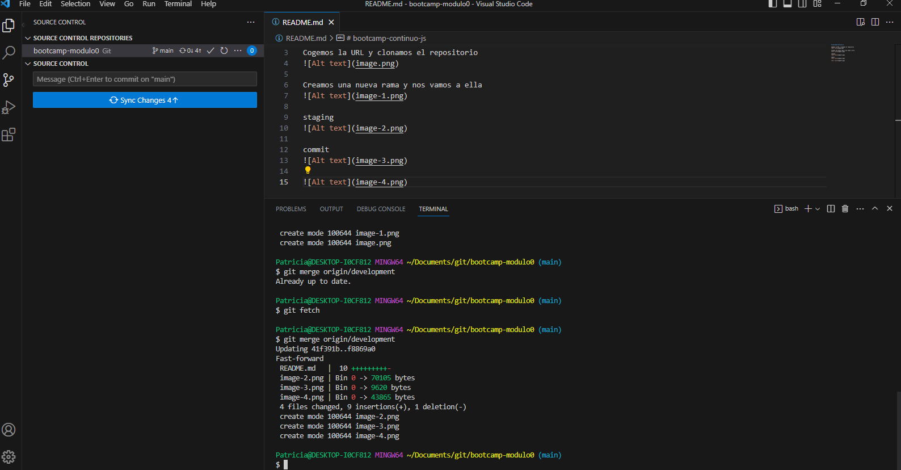

# bootcamp-continuo-js

Cogemos la URL y clonamos el repositorio

Creamos una nueva rama y nos vamos a ella 

staging

commit

hacemos push

hacemos el merge a main

repetimos proceso de subida
